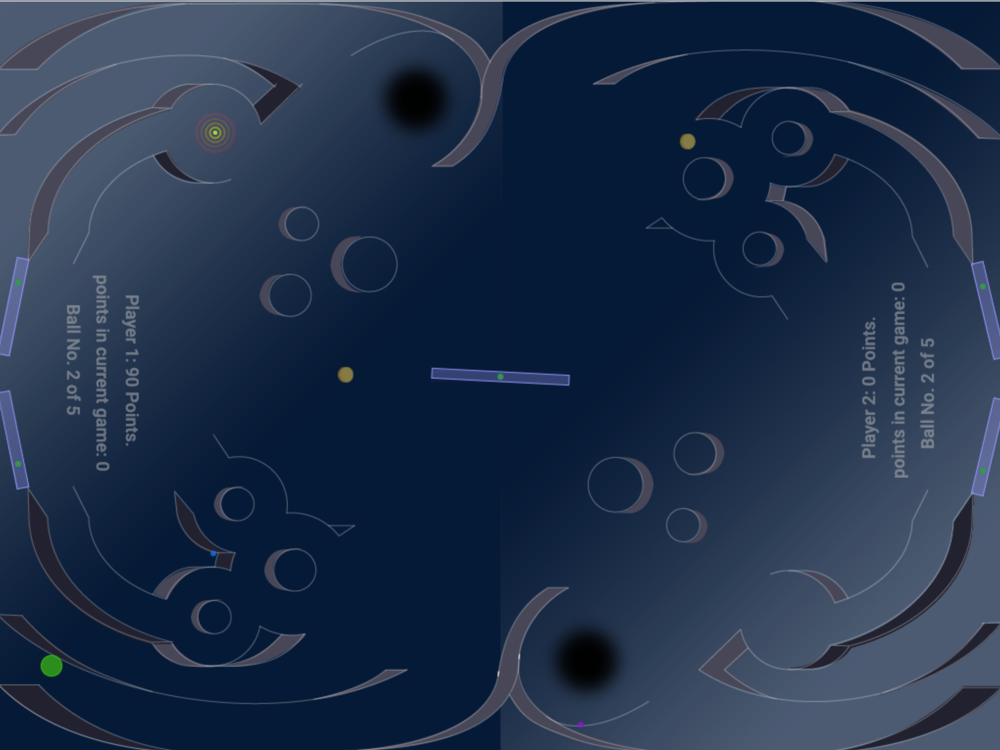

# Buoy

*HfG Schwäbisch Gmünd  
Internet of Things 
Semester 2, Basics in Media Space with Dr. Franklin Hernandez-Castro*

*by Christina Rost, Jana Seemann, Lea Kramer, Xian Wu  
April 2017*

  

### Two Player Pinnball Browser Game

Multiplayer Browser Pinnball with two gravity areas on each side of the field. One can earn points by catching the coins or hitting the buoys. 
Pay attention on the lightning strokes. This can confuse the playgame!  

### Control 
left player paddles with ***"w"*** & ***"s"***  
right player paddles with ***"o"*** & ***"l"***  
shoot ball with ***"space"***  

  
   

